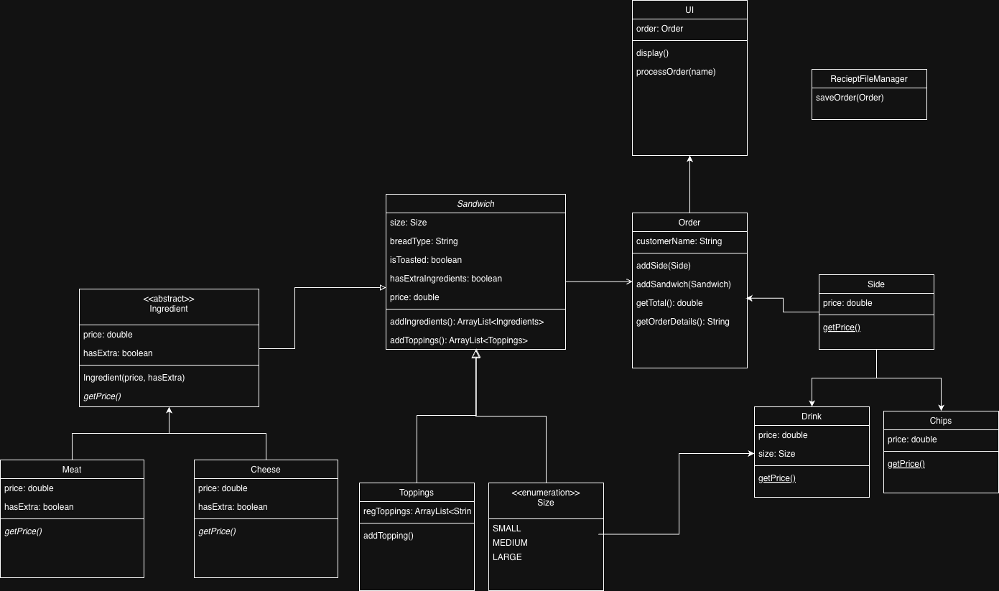

# Wendy's Deli-cious Sandwicheria
A food ordering command-line app that allows users to order sandwiches, chips, and drinks. It also returns a receipt file with the time they ordered the food.

Running the Code
The easiest way to run the code is to load it into IntelliJ IDEA and run the Main class.


## Class Diagram Before:



## Code I'm Most Proud of:
I'm proud of this specific code block because it simplified access to my different regular toppings enums. It allowed me to create methods and a HashSet that took in all regular toppings Enums without having to type cast it. 
```java
public interface Topping {
    String getName();
}
```

## My Personal Challenges
I struggled a bit with creating the class diagram because I was completely overthinking my class usages after feeling that I underperformed on the last capstone. 
I added unnecessary pressure upon myself which caused me to do more than I needed in terms of the actual programming.

Dave was a great help and even gave me advice over the weekend in order to detangle myself from my knot of diagrams. 
He made me realize I didn't need a String name for my classes nor did I need certain parent classes that didn't add anything to my program.

Even though I have previous knowledge of enums, I still did a bit of research on how to create a collection of more than one enum class which is what I really wanted to do from the beginning. 
I'm just glad that I was able to get out of my own head with the obvious assist from Dave.

## Next Time...
I will probably do more with the UI. I focused a lot more on the logic and didn't add as much of my creativity as I would like to. 
So hopefully I can do that and even connect a front-end using React like one of my peers in Section 9.

